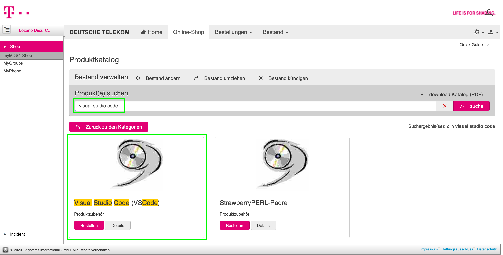
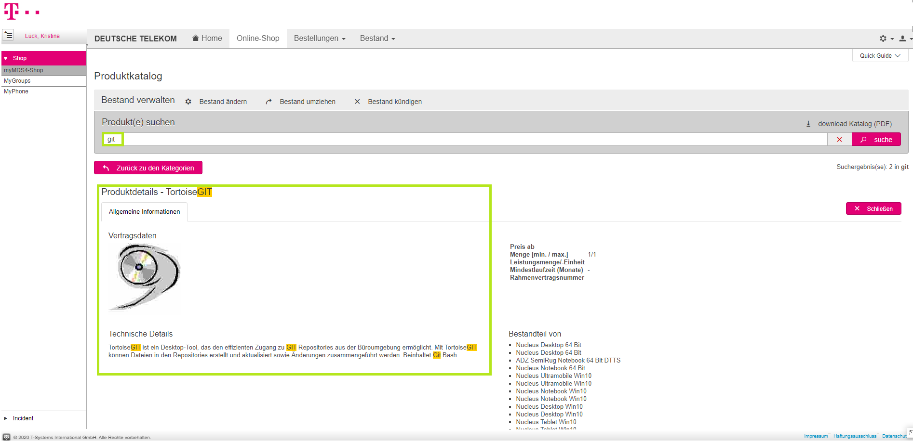
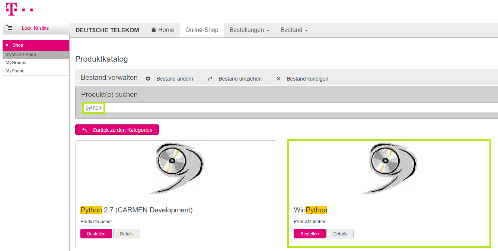
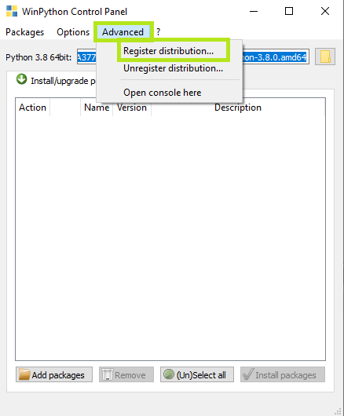
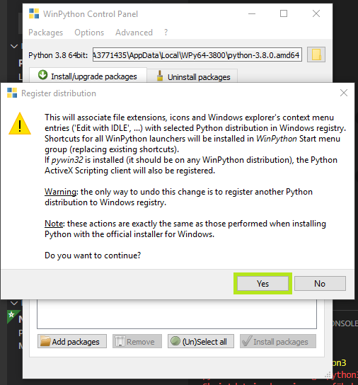
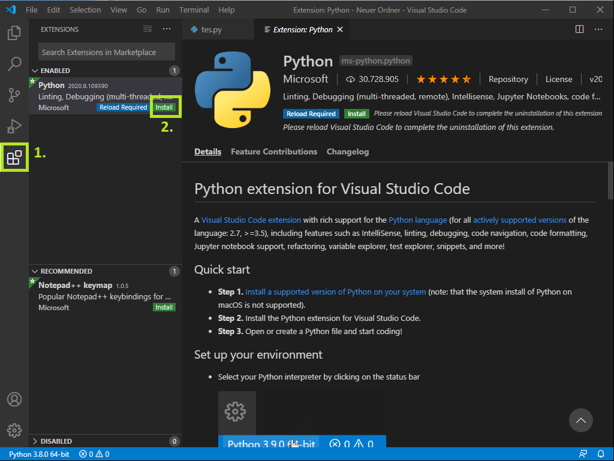
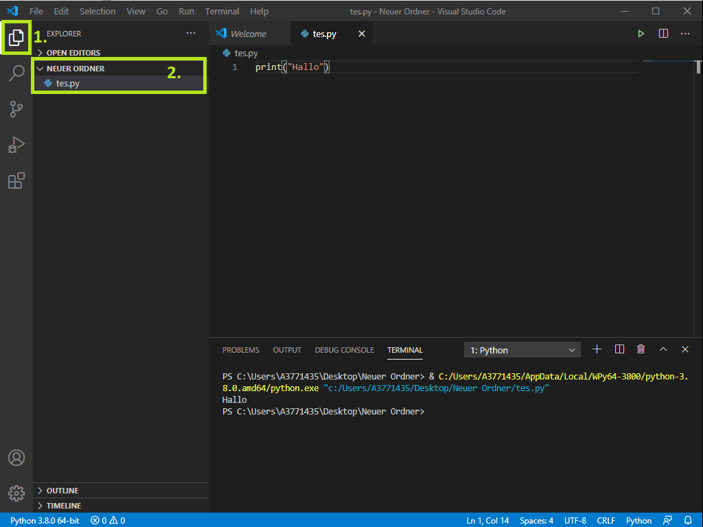

# Development Environment
## Windows

>   You can download most things from **myMDS4 Shop**: My Portal > Display MyWorkplace > myMDS4

### Recommended Tools

* Visual Studio Code (VSCode) --> (Admin rights are recommended)
* TortoiseGIT or Gitbash

#### Examples for programming languages available in myMDS4 shop

* WinPython (Python 2/3)
* Java Development Kit (JDK)

Example configuration made for Python.
#### Install Python and install the recommended Python extension in Visual Studio Code (VSCode)

The Python extension is only an example for an extension. Depending on your favourite programming language choose the fitting extension in VSCode.

1. Open WinPython Controlpanel

2. Click "Advanced" and then "Register distribution" 
(This is necessary to make sure that VSCode is able to give Python language support, when having activated the extension.)

3. Click "Yes" (You will need admin rights on your Windows laptop, to get access to the registry.) If you don't have admin rights install the portable version of WinPython.

4. Open Visual Studio Code (VSCode)

5. Add the Python extension to Visual Studio Code (or whatever extension you need for your favourite coding language).

6. Create a new folder for your code.

7. Right click in your folder and create a "New file". (In the pic above the file "tes.py" has already been created.)

:metal:

## MacOS

>   Install [Brew](https://brew.sh/) and install via `brew install <packagename>`.

### Recommended Tools

* Visual Studio Code
* SourceTree Git Client
* Gitbash

**Work in Progress**
